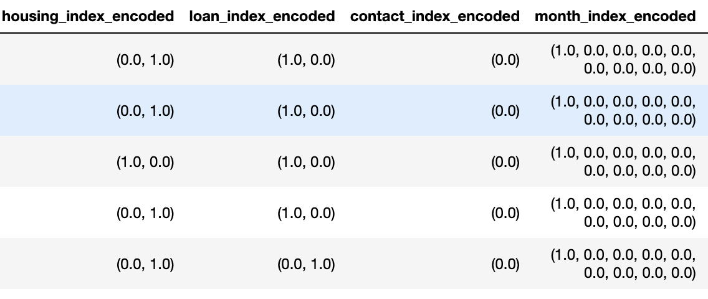

# Table of Contents

[Background of Analysis](#background-of-analysis)

[Executive Summary](#executive-summary)

[Exploratory Data Analysis](#exploratory-data-analysis)

[Predictive Models](#predictive-models)

[K-means Clustering](#k-means-clustering)

[Prescriptive Recommendations](#prescriptive-recommendations)

# Background of Analysis

The purpose of this project is to classify and identify clients who will
subscribe for a term deposit. The bank would like our team to conduct an
EDA to identify relationships and trends in the data that has been
provided. Following the EDA, we have been asked to develop and save a
predictive model for future classification of clients. In our modeling
section, you will find that we have tested many modelling techniques and
have explained our findings about each approach. Following our model
completion, you will find our prescriptive recommendations.

# Executive Summary

Our exploratory data analysis provided nothing out of the ordinary but
did increase our understanding of the provided dataset. Our primary
findings include the identification of variable types (10 numeric and 11
categorical), cardinality of each variable ("duration" with the highest
cardinality at 1544 & "Y" with the lowest cardinality at 2), no null
records found, and distributions as expected for both numeric and
categorical variables. Through our categorical variable distribution
plots, we can say that most of our population holds jobs in
administration or blue-collar, is married, and has at least a university
degree with a house and no loans.

Following some data transformation, we were ready to start building
predictive models to predict which clients will subscribe for a term
deposit. In total, we created 5 models: Logistic Regression, Decision
Tree, Random Forest, Gradient Boosted Tree, and Support Vector
Classifier. After running and comparing the models, we have concluded
that the Gradient Boosted Tree model performed the best and should be
the model that is implemented for production. The Gradient Boosted Tree
predicted with nearly 90% accuracy. Within this model "duration,"
"nr_employed," and "euribor3m" were identified as the 3 most important
features for prediction.

# Exploratory Data Analysis

To begin our exploratory data analysis, the team decided to identify the
numeric and categorical variables so we could begin to understand what
we were dealing with. After writing the code to do so, we asked it to
print a list of each. Those lists can be viewed below:


It does not appear that any variables stand out as potentially
incorrectly identified. There are 10 numeric variables and 11
categorical variables.

To further our understanding of the data, we decided to seek the
cardinality of all variables. To do so, we essentially counted the
number of distinct values contained by each variable. The variables
paired with their counts can be viewed below:

**Cardinality:**


As expected, there is a wide range of unique values from variable to
variable. As you can see, the variable with the highest cardinality
would be 'duration' with a distinct count of 1544 values, and the lowest
cardinality belongs to 'y' with a distinct count of 2 values.

Now that we have gotten some of the gritty details out of the way, we
now want to view the overall summary statistics for numeric variables
before going any deeper into variable transformation. The summary
statistics is quickly followed by a check of null values to ensure that
we are not dealing with any amount of missing data.

**Summary Statistics:**


**Check for Nulls:**


After reviewing the summary statistics, we can say that there is nothing
out of the ordinary regarding the numeric variables that would lead to a
need for transformation. It also appears that we got lucky with our data
as no null values have been identified that would have required removal
or imputation.

A deeper dive into our data would also require a check of the
distribution of the numeric and categorical variables. Most of the time,
you would be hoping to see relatively normal distributions across the
board, but that cannot always be expected. A plot of our numeric
variable distributions can be viewed below:


In these plots, we can see a couple of relatively normal distributions
such as Age, but most are heavily skewed. These may need to be
transformed in the future to conduct our modeling.

A plot of our categorical variable distributions can be viewed below:


In the case of distributions of categorical variables, we are not so
worried about normal distributions like we were for numerical variables.
This, rather, is more of a descriptive visualization to view
demographics of the population in our dataset. We can see that most of
our population holds jobs in administration or blue-collar, is married,
and has at least a university degree with a house and no loans.

We also found it particularly important to focus on the distribution of
the target variable "Y." You can view the distribution below:


**Bivariate Analysis of input variables:**


**Correlation between target and input variables:**


 

**Correlation Matrix:**


Correlation matrix shows the pairwise relation between input and target
variables. Higher correlation means that variable can explain more
variability in the target variable according to pearson correlation
coefficient.

# Predictive Models

The goal of the predictive models is to identify what customers are
likely to subscribe to a term deposit. We used the OneHotEncoder
function with job, marital, education, default, housing, loan, contact,
month, day_of_week and poutcome features to prepare them to be used in
the creation of the models.

The following picture shows a sample of the columns that were encoded
with the OneHotEncoder function.



In addition to encoding some features, we also used the StandardScaler
to standardize the scale of the features that were vectorized with the
VectorAssembler function.

The following image shows a sample of StandardScaler function's output.


The data were split using 80% for training and 20% for testing,
resulting in the following row distribution:


The distribution of the target variable in the two datasets (training
and test) are shown in the following tables, with the training dataset
on the left and the test dataset on the right:


The following table summarizes the results obtained with the 5 models
created for this dataset, the model with the best Accuracy was Gradient
Boosted Tree.


|         **Model**         | **Accuracy** | **Test Area Under ROC** | 
|:------------------------: |:------------:|:-----------------------:|
| Logistic Regression       | 0.9149       | 0.9359                  |
| Decision Tree             | 0.9159       | 0.5439                  |
| Random Forest Classifier  | 0.9056       | 0.9158                  | 
| Gradient Boosted Tree     | 0.9187       | 0.9428                  | 
| Support Vector Classifier | 0.9024       | 0.9279                  | 

The first model to explore is **Logistic Regression**, the following
images show the resulting confusion matrix and ROC Curve.


The following image shows sample predictions using the **Logistic
Regression** model, in it we can see that the model predicted correctly
rows 0, 1, 3 and 4, however, row 2 was predicted incorrectly as a 0
(customer doesn't subscribe to the term deposit) when it was a 1
(customer subscribes to the term deposit):


The second model used was **Decision Tree**, the following image shows
the resulting confusion matrix.


The following image shows sample predictions using the **Decision Tree**
model, the predictions are like those obtained with the previous model.


The third model we explored was **Random Forest**, the following images
show the resulting confusion matrix and ROC Curve. This model has the
best classification results out of the models tried up to this point.


The following image shows sample predictions using the **Random Forest**
model, the predictions are like the ones obtained with the previous
models.


The fourth model used on our analysis was a **Gradient Boosted**
**Tree**, the following image shows the resulting confusion matrix.


The following image shows sample predictions using the **Gradient
Boosted** **Tree** model, the predictions are like those obtained with
the previous models too.


The fifth model we explored was the **Support Vector Classifier**, the
following images show the resulting confusion matrix.


The following image shows sample predictions using the **Support Vector
Classifier** model, the predictions are like the ones obtained with the
previous models here as well.


|         **Model**         | **Accuracy** |**Test Area Under ROC**| 
|:------------------------: |:------------:|:---------------------:|
| Logistic Regression       | 0.915       | 0.936                  |
| Decision Tree             | 0.916       | 0.544                  |
| Random Forest Classifier  | 0.906       | 0.916                  | 
| Gradient Boosted Tree     | 0.919       | 0.943                  | 
| Support Vector Classifier | 0.902       | 0.928                  | 

Best model was found to be gradient boosted trees with highest accuracy
and ROC_AUC value.

# K-means Clustering

For the KMeans analysis we set 2 clusters, this is a required parameter
for this library.
```
> # Trains a k-means model.
>
> kmeans = KMeans().setK(2).setSeed(1)
>
> model_km = kmeans.fit(scaler_df.select(\'features\'))
>
> # Make predictions
>
> predictions_km = model_km.transform(scaler_df)
```

These are sample predictions obtained with the K-means clusters:


The Silhouette score for the K-means clustering model is 0.1168, this is
not a great score. It indicates that the clusters are overlapping, and
samples are very close to the other cluster decision boundary.

The clusters centers obtained are:


# Prescriptive Recommendations

The business problem we are trying to mitigate with this analysis is to
improve the marketing expense related to bringing new clients for a term
deposit to the bank. The sample dataset has a success rate of 12.70%,
which means there is a large marketing expense before hitting the right
customer (about 88 customers that will decline the offer before finding
the first term deposit subscriber). The prescriptive part of analytics
focuses on answering the question what should we do next?

In this case, based on the three most important variables in the
Gradient Boost model, duration, Nr.employed and Euribor3m, the first
recommendation is to define guidelines to interact with the customers.
Per the model with the highest accuracy (Gradient Boost), increasing the
customer interactions that have the best duration will have a direct
impact in the model results.

The other two features are social and economic context attributes, the
number of employees and the euribor rate (the rate of interest for
lending operations in the European Union interbank market). There is
little that can be done to modify them directly. It is possible however
to include these social and economic context attributes in the
information shared with customers in a way that can assuage their
concerns, for example information of euribor trends or how banks protect
from any unexpected rate change or lack of it.

In answering the question what we should do next we are trying to define
the strategy that will lead to an increase in the success rate of the
marketing expense.
